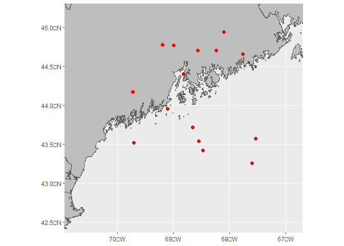

<!-- README.md is generated from README.Rmd. Please edit that file -->

#gglyr

Abstraction of mapping layers in ggplot2 for quick creation of high
quality maps.

## Set library path and view library layers

``` r
library(tidyverse)
```

    ## Warning: package 'tidyverse' was built under R version 4.2.3

    ## ── Attaching core tidyverse packages ──────────────────────── tidyverse 2.0.0 ──
    ## ✔ dplyr     1.1.0     ✔ readr     2.1.4
    ## ✔ forcats   1.0.0     ✔ stringr   1.5.0
    ## ✔ ggplot2   3.4.2     ✔ tibble    3.1.8
    ## ✔ lubridate 1.9.2     ✔ tidyr     1.3.0
    ## ✔ purrr     1.0.1     
    ## ── Conflicts ────────────────────────────────────────── tidyverse_conflicts() ──
    ## ✖ dplyr::filter() masks stats::filter()
    ## ✖ dplyr::lag()    masks stats::lag()
    ## ℹ Use the ]8;;http://conflicted.r-lib.org/conflicted package]8;; to force all conflicts to become errors

``` r
library(sf)
```

    ## Linking to GEOS 3.9.3, GDAL 3.5.2, PROJ 8.2.1; sf_use_s2() is TRUE

``` r
library(gglyr)
# Set gglyr library - this can be relative or absolute path. No support for URLs yet
gglyr_set_lib('c:/gglyr_lib')
# Testing retrieving currently set lib
gglyr_get_lib()
```

    ## [1] "c:/gglyr_lib"

``` r
# Can list all the layers in the current lib
gglyr_list_lyrs()
```

    ##       [,1]                   
    ##  [1,] "base_maine"           
    ##  [2,] "draft_wea"            
    ##  [3,] "gom_bathy"            
    ##  [4,] "lma1"                 
    ##  [5,] "lob_zone_lines"       
    ##  [6,] "lob_zone_polys"       
    ##  [7,] "maine_3nm"            
    ##  [8,] "maine_nm_lines"       
    ##  [9,] "maine_zone_dist_no_ol"
    ## [10,] "ne_coast"             
    ## [11,] "nw_atl_bathy"         
    ## [12,] "random_points"

## Create and add a layer to the library

``` r
# Load spatial data from remote URL
dist_from_shore <- geojsonsf::geojson_sf('https://services1.arcgis.com/RbMX0mRVOFNTdLzd/arcgis/rest/services/MaineDMR_Distance_From_Shore/FeatureServer/0/query?outFields=*&where=1%3D1&f=geojson')
```

    ## Warning in readLines(con): incomplete final line found on
    ## 'https://services1.arcgis.com/RbMX0mRVOFNTdLzd/arcgis/rest/services/MaineDMR_Distance_From_Shore/FeatureServer/0/query?outFields=*&where=1%3D1&f=geojson'

``` r
dist_from_shore <- dist_from_shore %>%
  dplyr::select(distance = Waters, zone = Zone, geometry)

# Make a ggproto and save it with gglyr_save
geom_sf(data = dist_from_shore, fill = NA, color = 'grey', inherit.aes = F) %>%
  gglyr_save(., 'maine_zone_dist_no_ol',
           'Maine lobster zones/distance from shore intersection with no overlaps, overlaps as zone C/D etc.')
```

    ## Layer already exists, overwriting...

## Load a layer from the library

``` r
ggplot() +
  gglyr('maine_zone_dist_no_ol')
```

 Data can
be extracted from ggproto back to SF object if needed:

``` r
proto <- gglyr('maine_zone_dist_no_ol')
distance <- proto[[1]]$data
class(distance)
```

    ## [1] "sf"         "data.frame"

## Multiple layers stacked

Can save multiple ggplot layers together as a list, ie, these layers
were loaded from boundaries.Rda as SF objects - to make it easier to
edit layer aesthetics, pass list names (vs numeric indices if none
present).

``` r
load('boundaries.Rda')

list(
  '3NM' = geom_sf(data = three_nm, color = 'darkorchid4', inherit.aes = F),
  '12NM' = geom_sf(data = twelve_nm, color = 'darkred', inherit.aes = F),
  '24NM' = geom_sf(data = twenty_four_nm, color = 'darkgreen', inherit.aes = F),
  'EEZ' = geom_sf(data = eez, color = 'grey', linetype = '21', inherit.aes = F)
) %>%
  gglyr_save(., 'maine_nm_lines', 'Maine 3NM line with US 12, 24NM lines and EEZ')
```

    ## Layer already exists, overwriting...

``` r
ggplot() +
  gglyr('ne_coast') +
  gglyr('maine_nm_lines') +
  coord_sf(xlim = c(-72, -67), ylim = c(42, 45))
```

    ## old-style crs object detected; please recreate object with a recent sf::st_crs()

    ## old-style crs object detected; please recreate object with a recent sf::st_crs()
    ## old-style crs object detected; please recreate object with a recent sf::st_crs()
    ## old-style crs object detected; please recreate object with a recent sf::st_crs()

 \##
Retrieve comment from layer

``` r
# Can retrieve comment from layer by passing verbose = T
gglyr('gom_bathy', verbose = T)
```

    ## Loaded layer gom_bathy with comment GEBCO GOM Bathy 0-300m.

    ## [[1]]
    ## mapping: x = ~x, y = ~y, fill = ~value * -1 
    ## geom_tile: linejoin = mitre, na.rm = FALSE
    ## stat_identity: na.rm = FALSE
    ## position_identity 
    ## 
    ## [[2]]
    ## <ScaleContinuous>
    ##  Range:  
    ##  Limits:    0 --    1

## Zoom a ggplot to the bounds of an SF layer

`gg_bound_sf(sf_layer)`

## Make nice maps quickly

``` r
ggplot() +
  gglyr('gom_bathy') +
  gglyr('ne_coast') +
  gglyr('maine_zone_dist_no_ol') +
  gglyr('maine_nm_lines') +
  # Bound it to outline of distance to shore
  gg_bound_sf(distance) +
  labs(x = 'Longitude', y = 'Latitude')
```

    ## old-style crs object detected; please recreate object with a recent sf::st_crs()
    ## old-style crs object detected; please recreate object with a recent sf::st_crs()
    ## old-style crs object detected; please recreate object with a recent sf::st_crs()
    ## old-style crs object detected; please recreate object with a recent sf::st_crs()


## What if the source spatial data changes??

If the source spatial data changes or is updated, right a function to
retrieve the data from the source file or URL and return a `ggproto`.
The function can receive additional arguments, ie:

``` r
random_maine_points <- function(points) {
  lats <- runif(points, min = 43, max = 45)
  lons <- runif(points, min = -70, max = -67)
  points <- data.frame(lat = lats, lon = lons) %>%
    st_as_sf(coords = c('lon', 'lat'), crs = 4326)
  p <- geom_sf(data = points, color = 'red', size = 2)
  return(p)
}

gglyr_save(random_maine_points, 'random_points', 'Generate random points off Maine.')
```

    ## Layer already exists, overwriting...

``` r
ggplot() +
  gglyr('ne_coast') +
  gglyr('random_points', points = 15) +
  gg_bound_sf(distance) +
  labs('15 Random Points')
```



``` r
ggplot() +
  gglyr('ne_coast') +
  gglyr('random_points', points = 100) +
  gg_bound_sf(distance) +
  labs('100 Random Points')
```


